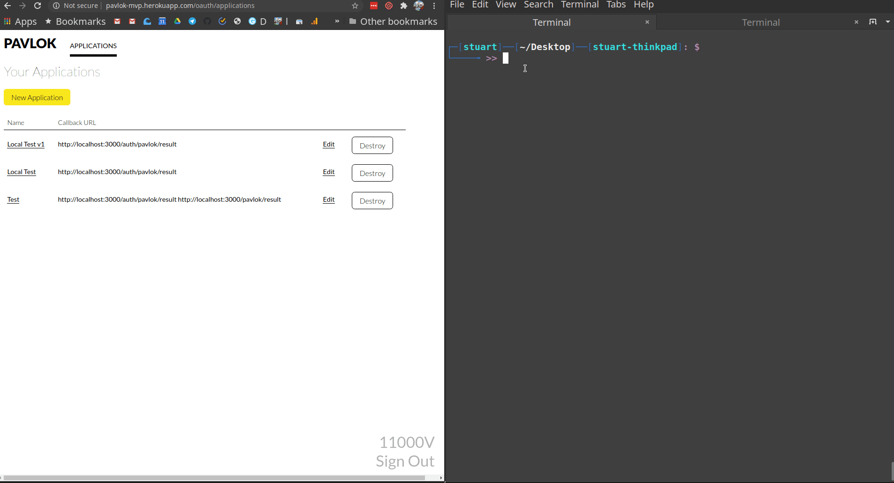
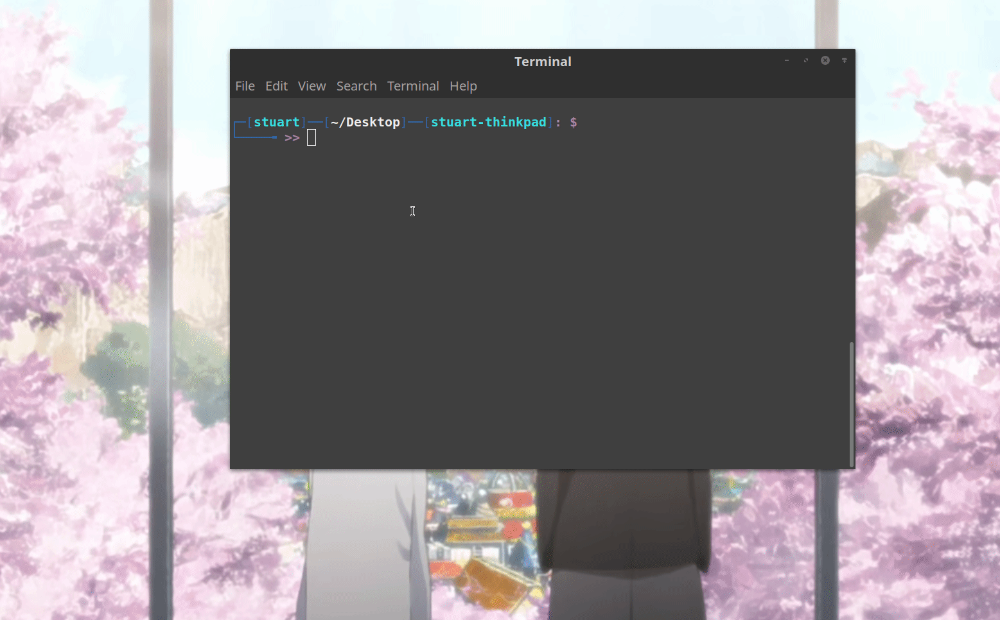
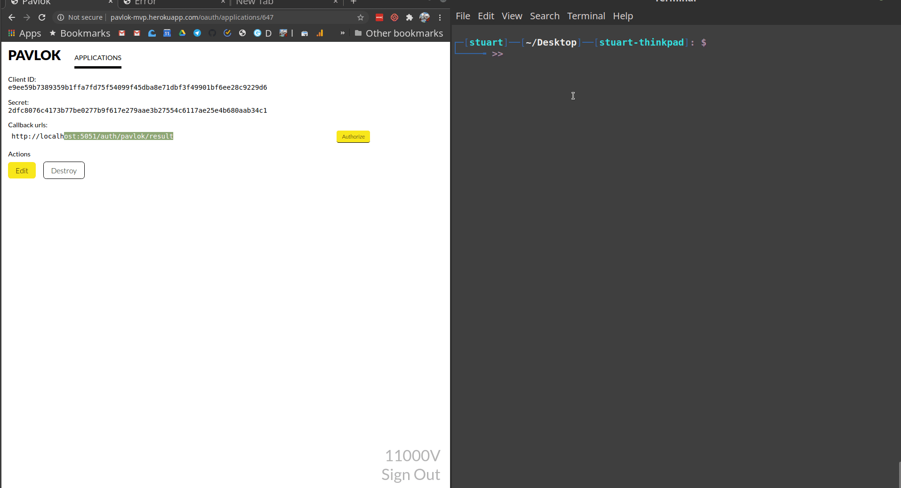

# Pavlok API Module
<a href="https://pavlok-developer-playground.herokuapp.com/" target="_blank"></a>
## Purpose
The Pavlok module makes it easy to play with your Pavlok device.

It works in two modes
- local development mode
- server mode

### Local Mode 

It can be used to play around with your device in a local development environment. It spins up a simple express server and needs permission to listen on one of your system's ports.

### Server Mode

It can be used to plug the module into your existing express server and build features/workflows for your pavlok device. 

## Installation

### Using NPM

```
npm install --save pavlok
```

### Using YARN

```
yarn add pavlok
```

## Setup

You would need two keys for the module to work
- `client ID`
- `client secret`

Navigate [here](http://pavlok-mvp.herokuapp.com/oauth/applications) and login with your Pavlok account to get one.

You'll need to choose a callback URL of `http://localhost:<PORT>/auth/pavlok/result` for local mode. Here, the `PORT` is the port you would like the module to run on in local mode. By default the value of `PORT` is `3000`.

Custom callback URLs are supported in server mode and is **required** while the module initialization.

## Usage

First thing you'd need to do is import the module into your app.

```
const pavlok = require('pavlok');
```

The simplest and quickest way to start using the module is to try it in the local mode.

```
pavlok.init(CLIENT_ID, CLIENT_SECRET);
pavlok.login(function (result, code) {
	if (result) {
		console.log("Code is " + code);
		pavlok.vibrate(); // or you can call other methods like beep() or zap()
	}
});
```

This spins up a server on port 3000.  (ex: http://localhost:3000/). It initializes the Pavlok module and logs you in. Now you can start sending the stimuli to your device.

If you would like to configure a custom port for the local mode, you can do so by passing a custom options object as the third paramater to the `init` method. Make sure to mention the port in the callback URL of application you created [here](http://pavlok-mvp.herokuapp.com/oauth/applications)

```
pavlok.init(CLIENT_ID, CLIENT_SECRET, { "port": 8080 }); // runs on port 8080
pavlok.login(function (result, code) {
	if (result) {
		console.log("Code is " + code);
	}
});
```
Here's short gif on how to use the pavlok module in local mode



Or, if you prefer NPM, here's how you can add it to your npm project



To Use the module in the server mode, you would need to pass a couple of more options in the the `init` method and ensure you call it before your server starts listening

```
pavlok.init(CLIENT_ID, CLIENT_SECRET, {
	"verbose": true,
	"app": app, //Express server
	"message": "Hello from the server example!", //Default message for all stimuli
	"callbackUrl": "<Your Server Root URL>/pavlok/result",
	"callbackUrlPath": "/pavlok/result",
	"successPath": "/success", //Where to redirect when the token has been saved to session
	"failurePath": "/error" //Where to redirect when the token couldn't be gotten/saved
});
app.get("/auth", function (req, res) {
	pavlok.auth(req, res);
});
```

Now that you are authenticated, you can start sending the stimuli to your Pavlok device from the server.

Stimuli methods for the server mode take a required parameter in the options object i.e. `request`. It is the request object that an express server gets when one of it's api is called. Stimuli methods expects an authorization token stored on the request object to verify the user.

So a simple call to one of the stimuli method would look like

```
// REQUEST is the request object in one of the express routes
pavlok.vibrate({request: REQUEST});
```

You can send in more optional paramters to configure the device stimuli. For example, you can increase the zap intensity to it's maximum by using the following code

```
pavlok.zap({request:REQUEST, intensity: 255})
```

Here's short gif on how to use the pavlok module in server mode



### Further Reading
See the [full documentation](https://github.com/Behavioral-Technology-Group/Pavlok_Node_Module/wiki) and [examples](https://github.com/Behavioral-Technology-Group/Pavlok-Node-Samples) for full documentation and a walkthrough. 

### Notes for Users Coming from Versions < 2
Though simliar, older versions of the module use slightly different syntax.
All the stimuli messages (`zap`, `beep`, etc.) now take their arguments in a 
single object with named parameters instead of the old ordered argument list.
Versions before 2 also didn't support server mode of the `pattern` option.

### License
Licensed under the ISC license. 
